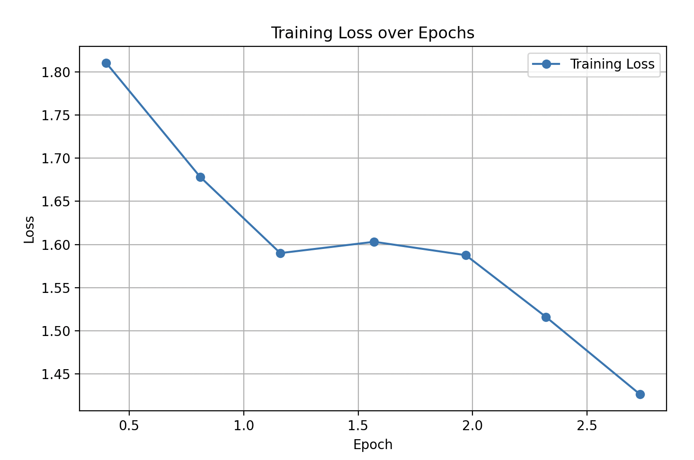

# Fine-Tuning a Generative Model for Code Summarization

This repository documents the implementation details and results of fine-tuning a generative model to perform class-level code summarization. In this README, you will find a detailed explanation of the rationale, setup, and outcomes of the task.


## Model Selection
For this task, we selected the model [`Llama-3.2-1B`](https://huggingface.co/meta-llama/Llama-3.2-1B) which is designed for multilingual dialogue and general summarization but not specifically for code. Many code generative models are pre-trained on datasets rich in source code, but `Llama-3.2-1B` lacks this inherent code specialization. By selecting a model outside the code domain, we imposed a more challenging learning task that tests the model's ability to generalize and adapt its natural language capabilities to the code summarization domain. This also makes this experiment interesting because it can simulate a real-world scenario where an organization might want to re-purpose a generalist model for a highly specialized task.

## Dataset
The dataset came from the  [Apache Airflow](https://github.com/apache/airflow) codebase, which includes a variety of well-documented Python classes. We used a self-supervised approach where the model learns to generate docstrings by using the existing docstrings in the code as ground truth. To prepare the data, we selected only classes that had docstrings at the start of their definition, making sure that each docstring was at least 20 tokens long. We also removed the docstring from the code input during training. Because we were working with limited hardware, we truncated any class code that exceeded 400 tokens to keep it within the model's input limits. 

One thing we paid attention to was the quality of the docstrings in the dataset. Since the goal was to train the model to produce good summaries, the ground truth also needed to be good. Ideally, we would review all docstrings manually. However, this process is tedious, especially when training datasets are large. Alternatively, we can use a larger model to check the quality of the ground truth data and filter out any that are not helpful. Given the limited resources for this project, we used the docstrings as they are, but this is something that could definitely be improved in future work.


> The size of the resulting dataset is 124 entries. We used 99 items for training and 25 entries for evaluation. We set a fixed standard seed (i.e., 42) for splitting data to make the training process reproducible.

## Fine-tuning

Fine-tuning is the standard approach for adapting a pre-trained model to a new, more specific task. Instead of training a model from scratch, where weights start from random initialization, fine-tuning builds on the knowledge already encoded during pretraining. Depending on the method, we can choose which weights to update and which to freeze. Full fine-tuning updates every weight in the model and generally provides the best performance, but it also requires the most resources. Since we were working with limited hardware and wanted a faster iteration cycle, we chose a parameter-efficient alternative: [Low-Rank Adaptation](https://arxiv.org/abs/2106.09685) (LoRA). LoRA allows training only small adapter layers while keeping the rest of the model frozen. This is efficient and works well when hardware resources are limited. We focused on the attention head inside the transformer blocks, specifically at the `queries`, `keys`, `values` and `output projection` matrices. We set the LoRA rank `r` to 16, which controls the size of the adapter layers. This value is a balanced choice that offers enough learning capacity without making the adapter too large. We set `lora_alpha` to 32, which scales the output of the adapter layers and helps balance the LoRA updates with the frozen parts of the model. Additionally, we applied a small `dropout` of 0.05 to the LoRA adapters to reduce overfitting. We also set `bias` to `none`, meaning we left the bias terms untouched to keep the setup simple and focused. We followed these settings based on other usages of LoRA. 

The batch size was set to 1 because we trained locally on limited hardware using the MPS backend, which has memory constraints similar to GPU setups. To get around this, we used gradient accumulation with 8 steps, which simulates a larger effective batch size by accumulating gradients before updating weights. This approach helps reduce noise in gradient updates but still fitting within the hardware limits. We trained for 3 epochs, which gave the model some exposure to the data, however, it is also important to later on experiment with a larger number to ensure that the model learns meaningful patterns.


For the prompt, we kept the design quite simple and clear. The prompt included the class name and source code, followed by the instruction. We tokenized the code part first, ensuring it was truncated if necessary to make room for the instruction string, and then combined both before padding the result to a maximum of 512 tokens (which was in line with the hardware limitations). For the labels, we tokenized the docstrings and padded them to 256 tokens. On average, the docstring tokens are 80, and average tokens in the source code are 347, hence, the size limits for the input and labels were enough to ensure that we cover most cases.


## Evaluation and Results

To evaluate the model's performance, we computed both [chrF](https://aclanthology.org/W15-3049/) and [ROUGE-L](https://aclanthology.org/W04-1013/) scores, which are common metrics for automatically evaluating generated text summaries. chrF measures how well the generated docstrings match the ground truth at the character level, while ROUGE-L focuses on the longest common subsequence between the prediction and the target. There are also other metrics that can be use (e.g. BERTScore, BLEU, METEOR) however, for this simple use case, the two metrics give a balance between nuance and simplicity. 

During inference, we tested two types of prompts, both of which matched the formats used during fine-tuning to maintain consistency. For decoding, we used nucleus sampling with a `top_p` of 0.9 and a `temperature` of 0.7. We chose these settings to encourage more diverse generations from a pool of high probable options.

In the figure below, we show how the loss changed over epochs. The plot indicates a steady decrease in loss, which confirms that the model was improving its ability to predict the target docstrings based on the input code during training:



### Prompt Sensitivity and Its Effect on Model Performance

We found that the model was highly sensitive to the prompt format during inference and training. At first, we used the same verbose prompt as during fine-tuning:

```
"Your task is to write a docstring that summarizes the following Python class.\n"
Class {class_name}:
{source_code}"

Docstring:
```

Although this matched the fine-tuning setup, it produced weaker results. The model often gave incomplete, generic outputs and tried to explain the reasoning behind its answer. 

We then tested a much simpler prompt:
```
Class {source_code}

Docstring:
```

This approach performed better because when we fine-tune a model, it doesn't "understand" tasks in the same way a human would. Instead, it learns token patterns and it associates specific sequences of tokens (like the verbose instruction) with corresponding outputs (the docstring). Moreover, the fine-tuning dataset is not large enough in our case and hence the model may overfit to the exact prompt format and struggle to adapt when even minor changes occur.

### Results

One important observation is that the prompt design had a significant impact on performance. We noticed that when using the verbose prompt format for both fine-tuning and evaluation, results were weaker compared to using the simple prompt.

Despite these challenges, fine-tuning consistently improved the chrF scores across both prompt types. The highest ROUGE-L score was achieved with the fine-tuned model using the simple prompt and manual inspection confirmed that this model produced slightly better docstrings overall. However, it's important to note that these results are not significant enough, as the dataset was quite small: 99 samples for training and 25 for evaluation. Ideally, we would have started with a larger dataset or a simpler codebase.

| Scenario | chrF Score | ROUGE-L Score |
|-------|---------------|---------------|
| baseline with verbose prompt   | 15.98         | 0.1        |
| finetuned with verbose prompt   | 17.99         | 0.12        |
| baseline with simple prompt   | **22.88**         | 0.12        |
| finetuned with simple prompt   | 20.54         | **0.14**        |


## Improvements for future

To achieve better results, several improvements are recommended:

- Dataset expansion: Increasing the size and diversity of the dataset would help the model generalize better and reduce overfitting.

- Docstring quality control: Using automated or manual review to ensure high-quality docstrings would provide better supervision.

- Experiment with larger models: Testing a code-specialized model (such as CodeLlama) or a larger general model could offer stronger baseline performance.

- Experiment with other fine-tuning techniques. For example, we could incorporate retrieval-augmented generation (RAG) methods to provide additional relevant context from the repository's documentation during inference.


## Instructions for reproducibility:

To install the necessary requirements, please run `pip install -r requirements.txt`.
 
In the `dataset-collection/collect.py` you can find the implementation for data collection and pre-processing.

The scripts for fine-tuning and evaluation can be found in `finetune-evaluate/finetune.py` and `finetune-evaluate/eval.py`, respectively.

# Links:

- Dataset: https://huggingface.co/datasets/anaterna/airflow-class-summarization
- Finetuned model using verbose prompt: https://huggingface.co/anaterna/llama-3.2-1B-finetunedv1
- Finetuned model using simple prompt: https://huggingface.co/anaterna/llama-3.2-1B-finetuned
